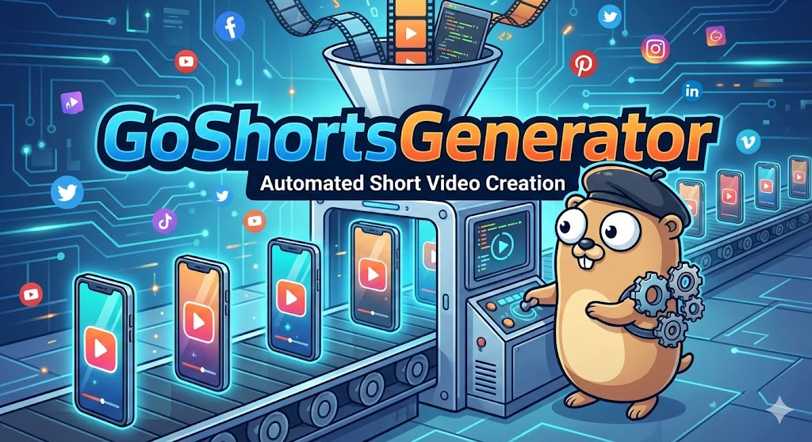
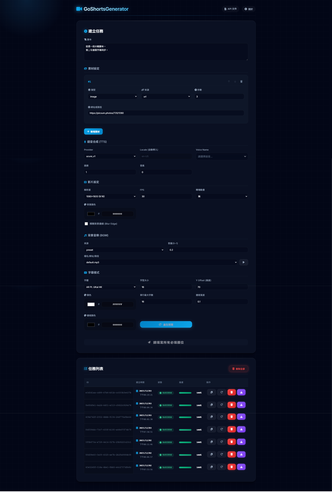
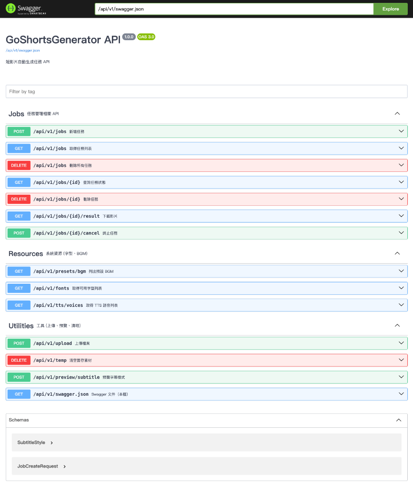

# GoShortsGenerator

<div align="center">

#### 中文 | [English](README_EN.md)

</div>



<div align="center">

[](https://golang.org/)
[](https://reactjs.org/)
[](https://www.docker.com/)
[](https://hub.docker.com/r/reggiepan/goshortsgenerator)
[](LICENSE)

**全自動化短影音生成平台**

[功能特性](#功能特性-) • [快速開始](#快速開始-) • [配置要求](#配置要求-) • [使用說明](#使用說明-) • [API 文件](#api-文件-)

</div>

---

**GoShortsGenerator** 是一個專為快速製作短影音 (Shorts) 而設計的自動化平台。透過整合先進的 AI 語言模型與語音合成技術，使用者僅需提供腳本與素材，系統即可自動完成斷句、配音、字幕生成與影片合成，大幅縮短內容創作週期。

<div align="center">
  
</div>

## 功能特性 🎯

*   **🤖 全自動化流程**：一鍵完成從腳本到成片的複雜工序，無需人工干預。
*   **🧠 AI 智能賦能**：
    *   整合 **Google Gemini 2.0 Flash** 進行精準腳本斷句與語意分析。
    *   支援 **Edge TTS**（免費）或 **Microsoft Azure TTS** 生成自然流暢的神經網路語音。
*   **🎨 高度客製化**：
    *   支援自訂字幕樣式（字體、顏色、大小）。
    *   自由搭配背景音樂、轉場效果與背景模糊處理。
*   **🐳 容器化部署**：基於 Docker 架構，部署簡單，確保環境一致性。

## 技術棧 🛠️

| 領域 | 技術 |
| :--- | :--- |
| **前端** | React v18, Vite, Sass |
| **後端** | Go 1.24 (Gin Framework) |
| **資料儲存** | Local File System |
| **容器化** | Docker, Docker Compose ([Docker Hub](https://hub.docker.com/r/reggiepan/goshortsgenerator)) |
| **AI 引擎** | Google Gemini 2.0 Flash (LLM), Edge TTS / Microsoft Azure TTS |
| **影片處理** | FFmpeg |

## 快速開始 🚀

### 1. 複製專案

```bash
git clone https://github.com/Reggie-pan/go-shorts-generator.git
cd go-shorts-generator
```

### 2. 設定環境變數

修改 `docker-compose.yml`，填入您的 API Key：

```yaml
environment:
  - AZURE_TTS_KEY=your_azure_key       # 可選 (若使用 Edge TTS 則不需要)
  - AZURE_TTS_REGION=your_azure_region # 可選 (若使用 Edge TTS 則不需要)
  - GEMINI_API_KEY=your_gemini_key     # 必填
```

### 3. 啟動服務

使用 Docker Compose 一鍵啟動：

```bash
docker-compose up -d --build
```

### 4. 訪問應用程式

*   **Web 介面**：[http://localhost:8080](http://localhost:8080)
*   **API 文件**：[http://localhost:8080/swagger/index.html](http://localhost:8080/swagger/index.html)

## 配置要求 📦

以下是 `docker-compose.yml` 中的關鍵環境變數說明：

| 變數名稱 | 說明 | 範例值 |
| :--- | :--- | :--- |
| `PORT` | 應用程式服務埠號 | `8080` |
| `STORAGE_PATH` | 任務資料儲存路徑 | `/data` |
| `BGM_PATH` | 背景音樂儲存路徑 | `/assets/bgm` |
| `AZURE_TTS_KEY` | Azure TTS 服務金鑰 (可選，若使用 Edge TTS 則不需要) | `...` |
| `AZURE_TTS_REGION` | Azure TTS 服務區域 (可選，若使用 Edge TTS 則不需要) | `...` |
| `GEMINI_API_KEY` | Google Gemini API 金鑰 (**必填**) | `...` |
| `AI_MODEL` | 使用的 Gemini 模型版本 | `gemini-2.0-flash` |

## 使用說明 📖

1.  **準備素材** 📂
    *   準備好您的影片素材 (圖片或影片) 與背景音樂。
    
2.  **填寫腳本** ✍️
    *   在 Web 介面上輸入您的影片腳本。

3.  **設定參數** ⚙️
    *   選擇 **TTS 語音** (支援多國語言)。
    *   設定 **字幕樣式** (字體、顏色、大小)。
    *   調整 **影片設定** (解析度、背景模糊、轉場效果)。

4.  **提交任務** ▶️
    *   點擊「建立任務」，系統將自動開始處理。

5.  **下載成品** 🎬
    *   待任務完成後，即可預覽並下載生成的影片。

## API 文件 📄

本專案提供完整的 RESTful API，方便開發者進行二次開發或整合：

*   **Swagger UI**: [http://localhost:8080/swagger/index.html](http://localhost:8080/swagger/index.html)



## 授權條款 📝

本專案採用 [MIT License](LICENSE) 授權。
