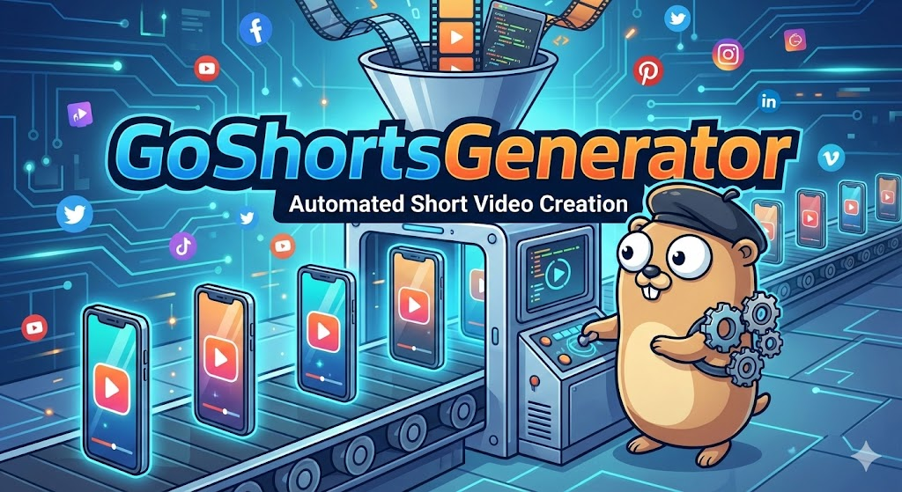
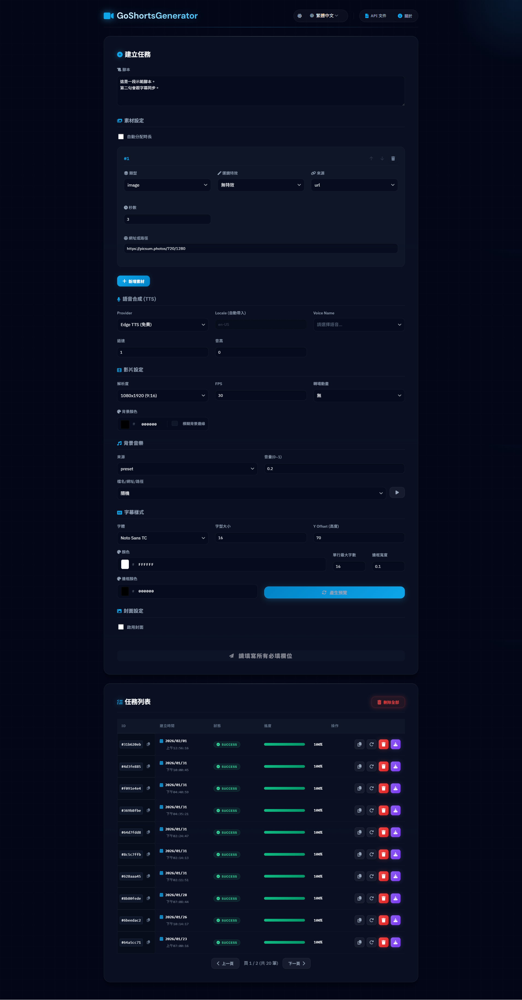
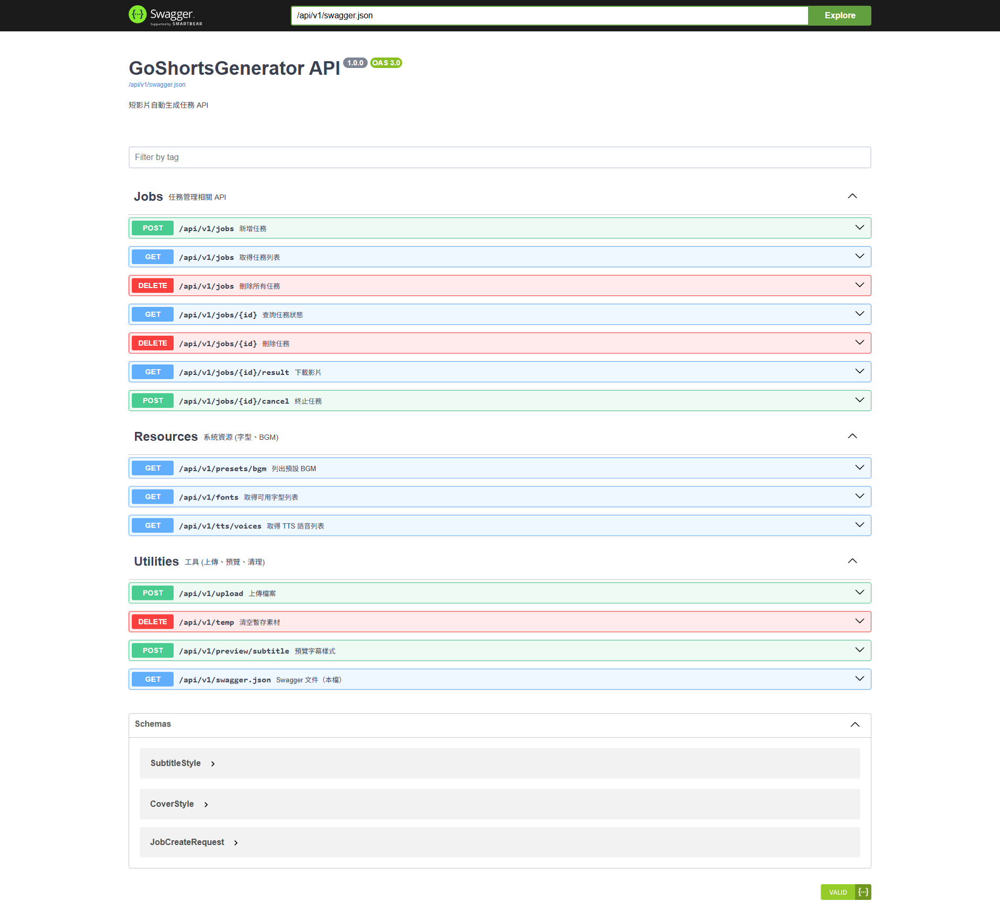

# GoShortsGenerator

<div align="center">

#### [中文](README.md) | English

</div>



<div align="center">

[](https://golang.org/)
[](https://reactjs.org/)
[](https://www.docker.com/)
[](https://hub.docker.com/r/reggiepan/goshortsgenerator)
[](LICENSE)

**Fully Automated Short Video Generation Platform**

[Features](#features-) • [Quick Start](#quick-start-) • [Requirements](#requirements-) • [Usage](#usage-) • [API Docs](#api-docs-)

</div>

---

**GoShortsGenerator** is an automated platform designed for quickly creating short videos (Shorts). By integrating advanced AI language models and speech synthesis technology, users simply need to provide a script and assets, and the system automatically handles sentence segmentation, voiceover, subtitle generation, and video synthesis, significantly reducing the content creation cycle.

<div align="center">
  
</div>

## Features 🎯

*   **🤖 Fully Automated Workflow**: One-click completion of complex processes from script to final video, with no manual intervention required.
*   **🧠 AI Powered**:
    *   Integrates **Google Gemini 2.0 Flash** for precise script segmentation and semantic analysis.
    *   Supports **Edge TTS** (Free) or **Microsoft Azure TTS** to generate natural, fluid neural network speech.
*   **🎨 Highly Customizable**:
    *   Supports custom subtitle styles (font, color, size).
    *   Freely mix background music, transition effects, and background blur processing.
*   **🎬 Title Cover**:
    *   Supports automatic generation of video opening covers with title text and gradient/blurred backgrounds.
    *   Optional title voice, with cover duration automatically adjusted based on voice length.
*   **🐳 Containerized Deployment**: Built on Docker architecture for simple deployment and consistent environments.

## Tech Stack 🛠️

| Area | Technology |
| :--- | :--- |
| **Frontend** | React v18, Vite, Sass |
| **Backend** | Go 1.24 (Gin Framework) |
| **Data Storage** | Local File System |
| **Containerization** | Docker, Docker Compose ([Docker Hub](https://hub.docker.com/r/reggiepan/goshortsgenerator)) |
| **AI Engine** | Google Gemini 2.0 Flash (LLM), Edge TTS / Microsoft Azure TTS |
| **Video Processing** | FFmpeg |

## Quick Start 🚀

### 1. Clone Project

```bash
git clone https://github.com/Reggie-pan/go-shorts-generator.git
cd go-shorts-generator
```

### 2. Set Environment Variables

Modify `docker-compose.yml` and fill in your API Keys:

```yaml
environment:
  - AZURE_TTS_KEY=your_azure_key       # Optional (Not required if using Edge TTS)
  - AZURE_TTS_REGION=your_azure_region # Optional (Not required if using Edge TTS)
  - GEMINI_API_KEY=your_gemini_key     # Required
```

### 3. Start Services

Start with one click using Docker Compose:

```bash
docker-compose up -d --build
```

### 4. Access Application

*   **Web Interface**: [http://localhost:8080](http://localhost:8080)
*   **API Docs**: [http://localhost:8080/swagger/index.html](http://localhost:8080/swagger/index.html)

## Requirements 📦

The following are descriptions of key environment variables in `docker-compose.yml`:

| Variable Name | Description | Example Value |
| :--- | :--- | :--- |
| `PORT` | Application service port | `8080` |
| `STORAGE_PATH` | Task data storage path | `/data` |
| `BGM_PATH` | Background music storage path | `/assets/bgm` |
| `AZURE_TTS_KEY` | Azure TTS Service Key (Optional, not required if using Edge TTS) | `...` |
| `AZURE_TTS_REGION` | Azure TTS Service Region (Optional, not required if using Edge TTS) | `...` |
| `GEMINI_API_KEY` | Google Gemini API Key (**Required**) | `...` |
| `AI_MODEL` | Gemini Model Version | `gemini-2.0-flash` |

## Usage 📖

1.  **Prepare Assets** 📂
    *   Prepare your video assets (images or videos) and background music.
    
2.  **Write Script** ✍️
    *   Enter your video script on the Web interface.

3.  **Configure Settings** ⚙️
    *   Select **TTS Voice** (supports multiple languages).
    *   Set **Subtitle Style** (font, color, size).
    *   Adjust **Video Settings** (resolution, background blur, transition effects).

4.  **Submit Task** ▶️
    *   Click "Create Task" and the system will automatically start processing.

5.  **Download Result** 🎬
    *   Once the task is complete, you can preview and download the generated video.

## API Docs 📄

This project provides a complete RESTful API for developers to extend or integrate:

*   **Swagger UI**: [http://localhost:8080/swagger/index.html](http://localhost:8080/swagger/index.html)



## License 📝

This project is licensed under the [MIT License](LICENSE).
